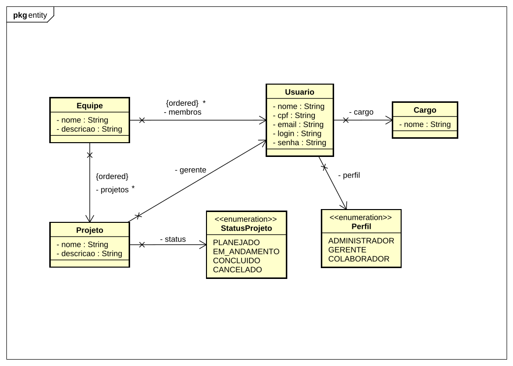

# Sistema de Gestão de Projetos e Equipes


## 🎓 Informações Acadêmicas
- **Atividade:** A3 - Projeto Avaliativo
- **Universidade:** Universidade Anhembi Morumbi
- **Curso:** Sistemas de Informação
- **Unidade Curricular:** Programação de Soluções Computacionais
- **Semestre:** 1º Semestre

## 📌 Visão Geral do Projeto
Este projeto é um sistema desktop desenvolvido em Java para o gerenciamento corporativo de projetos, tarefas, equipes e controle de prazos. O foco da aplicação é entregar uma solução baseada nas melhores práticas de **Engenharia de Software**, garantindo manutenibilidade através de uma arquitetura limpa (MVC), banco de dados relacional e purismo na **Programação Orientada a Objetos**.

O sistema atende a necessidades táticas (Gerentes de Projeto) e operacionais (Desenvolvedores/Analistas), substituindo controles descentralizados em planilhas por uma plataforma unificada de visibilidade de entregáveis e alocação de recursos.

## 🏗️ Modelagem e Arquitetura

### Diagrama Entidade-Relacionamento (DER)
A modelagem de dados foi desenhada focando em normalização estrutural, contendo Entidades e Tabelas Associativas para controle de integridade referencial.


### Diagrama de Classes UML
A arquitetura de software utiliza a **Composição de Objetos** para garantir um mapeamento rico. As referências do relacional (chaves estrangeiras estáticas) são representadas no código por instâncias nativas do Java (ex: `Equipe` possui explicitamente uma `List<Usuario>`), todas controladas pelos algoritmos do JPA.


## ⚙️ Tecnologias Utilizadas
- **Linguagem Base:** Java 21 (LTS)
- **Persistência de Dados:** JPA / Hibernate ORM
- **Versionamento de Banco de Dados:** Flyway
- **Banco de Dados:** PostgreSQL
- **Gerenciador de Dependências e Build:** Apache Maven
- **Interface Gráfica (GUI):** Java Swing + FlatLaf 3.4.1 (FlatDarkLaf)
- **Padrão Arquitetural:** MVC (Model-View-Controller)
- **Modelagem Visual:** Astah UML & Draw.io

## 📂 Documentação e Evolução do Projeto
O desenvolvimento arquitetural e o processo avaliativo do sistema iteram em processos de *Sprints Semanais*. Abaixo encontra-se o índice centralizador dos meus levantamentos, decisões técnicas pessoais e relatórios métricos.

### Sprints de Avaliação e Entregas

| Sprint | Período | Escopo | Status |
|--------|---------|--------|--------|
| **Sprint 1** | 22/03 – 28/03/2026 | Modelagem & Arquitetura | ✅ Completo |
| **Sprint 2** | 29/03 – 04/04/2026 | Banco de Dados & Camada de Modelo | ✅ Completo |
| **Sprint 3** | 05/04 – 11/04/2026 | Repositórios & Controllers | ✅ Completo |
| **Sprint 4** | 12/04 – 18/04/2026 | Refinamento do Backend & Entidade Tarefa | ✅ Completo |
| **Sprint 5** | 19/04 – 25/04/2026 | Interface Gráfica (Swing) + FlatLaf | ✅ Completo |
| **Sprint 6** | 26/04 – 02/05/2026 | Relatórios de Desempenho | ✅ Completo |

---

#### Sprint 1 — Modelagem e Arquitetura `22/03 – 28/03/2026` ✅
Levantamento de requisitos, criação do Diagrama Entidade-Relacionamento (DER) para a base de dados e do Diagrama de Classes UML. Criação do repositório no GitHub.
- 👉 [Sprint Backlog](docs/sprints/sprint-01/backlog.md)
- 👉 [Relatório de Desenvolvimento](docs/sprints/sprint-01/relatorio.md)

#### Sprint 2 — Banco de Dados e Camada Model `29/03 – 04/04/2026` ✅
Criação da base de dados relacional e migration Flyway para criação das tabelas. No código Java: implementação da camada Model com as entidades, configuração do Entity Manager (JPA) e construção da camada de persistência utilizando Hibernate.
- 👉 [Sprint Backlog](docs/sprints/sprint-02/backlog.md)
- 👉 [Relatório de Desenvolvimento](docs/sprints/sprint-02/relatorio.md)

#### Sprint 3 — Repositories e Controllers `05/04 – 11/04/2026` ✅
Desenvolvimento da camada Repository para acesso a dados e mapeamento objeto-relacional com JPA/Hibernate. Criação da camada Controller para encapsular as regras de negócio e intermediar o fluxo entre a interface e a base de dados. Introdução do `JpaUtil` como Singleton do `EntityManagerFactory` e centralização de credenciais em `db.properties`.
- 👉 [Sprint Backlog](docs/sprints/sprint-03/backlog.md)
- 👉 [Relatório de Desenvolvimento](docs/sprints/sprint-03/relatorio.md)

#### Sprint 4 — Refinamento do Backend & Entidade Tarefa `12/04 – 18/04/2026` ✅
Complementação da camada de domínio com a entidade Tarefa, segurança no armazenamento de senhas com BCrypt e ajuste dos controllers existentes para integridade referencial com a nova entidade.
- 👉 [Sprint Backlog](docs/sprints/sprint-04/backlog.md)
- 👉 [Relatório de Desenvolvimento](docs/sprints/sprint-04/relatorio.md)

#### Sprint 5 — Interface Gráfica (Swing) + FlatLaf `19/04 – 25/04/2026` ✅
Construção da camada View completa com Java Swing e FlatLaf como Look & Feel moderno. Navegação por `CardLayout` (login ↔ dashboard) e `JTabbedPane` com painéis CRUD para todas as entidades do domínio. Integração total dos formulários com os controllers existentes.
- 👉 [Sprint Backlog](docs/sprints/sprint-05/backlog.md)
- 👉 [Relatório de Desenvolvimento](docs/sprints/sprint-05/relatorio.md)

#### Sprint 6 — Relatórios de Desempenho `26/04 – 02/05/2026` ✅
Implementação da camada de relatórios analíticos sem alterações no banco de dados. Criação do `RelatorioController` (stateless, somente leitura) com agregação de métricas de projetos e membros. DTOs imutáveis (`ResumoProjeto`, `CargaUsuario`) como contrato entre Controller e View. `RelatorioPanel` com três abas: Resumo Global (cards por status), Desempenho por Projeto (métricas de tarefas e prazo) e Carga de Trabalho (distribuição de tarefas por membro).
- 👉 [Sprint Backlog](docs/sprints/sprint-06/backlog.md)
- 👉 [Relatório de Desenvolvimento](docs/sprints/sprint-06/relatorio.md)

## 🚀 Como Executar Localmente

### Pré-requisitos
- Java 21+
- Maven 3.x
- Docker e Docker Compose

### 1. Configurar credenciais do banco
Copie o template e ajuste as credenciais para seu ambiente local:
```bash
cp src/main/resources/db.properties.example src/main/resources/db.properties
```

### 2. Subir o banco de dados
```bash
docker compose up -d
```

### 3. Executar as migrações Flyway
```bash
mvn flyway:migrate
```

### 3. Compilar e executar a aplicação
```bash
mvn compile exec:java -Dexec.mainClass="com.vbaggio.projectapp.Application"
```
